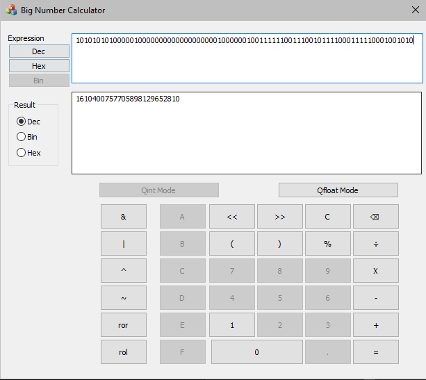
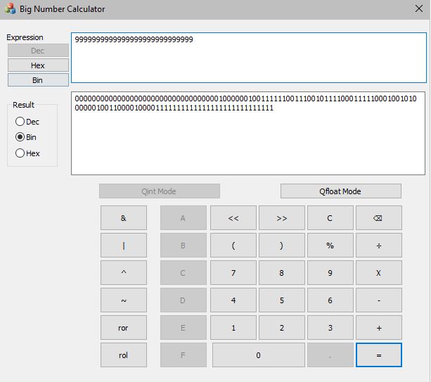

# BigNumber

BigNumber is a project in C++ that implements the QInt and QFloat data types, each of which is 16 bytes in size. These data types enable the representation of larger numbers compared to standard data types in C++ programming. Additionally, the project includes an application resembling a simple calculator to demonstrate the capabilities of these data types.

## Features

- Implementation of QInt and QFloat data types
- Enables representation of larger numbers
- Simple calculator application

## Demo

## Installation

To use BigNumber, follow these steps:

1. Clone this repository to your local machine.
2. Ensure you have a C++ compiler installed.
3. Build the project using your preferred build system.
4. Run the executable.

## Usage

Once BigNumber is running, you can:

- Utilize the QInt and QFloat data types to work with larger numbers.
- Use the calculator application to perform arithmetic operations and demonstrate the capabilities of the implemented data types.

## Contributing

Contributions are welcome! If you have any ideas for improvements or new features, feel free to open an issue or submit a pull request.

## Acknowledgements

- Inspired by computer architecture principles
- Implemented in C++ programming language

